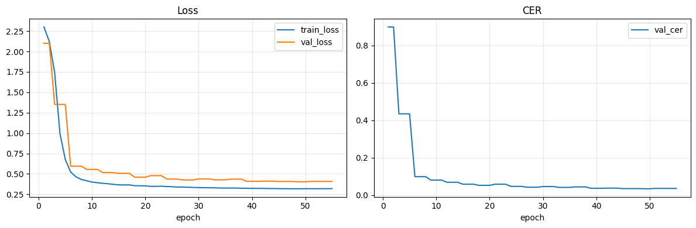

# Spoken Numbers Recognition Challenge

## Введение

В данном проекте необходимо обучить модель для распознавания произнесенных на русском языке чисел от 1000 до 999999.

Изначально ключевой идеей было отказаться от букв и предсказывать напрямую числа (по цифрам). Данный ход, по предположению, 
позволяет упростить задачу и избежать множества архитектурных проблем и узких мест. (Однако, как показала практика, лучшие решения 
как раз использовали CTC и работали на уровне слов / букв)

Итоговая модель является encoder-decoder трансформером с conformer энкодером и имеет 4М параметров. 
Важным шагом является обучение модели с множеством различных аугментаций. 

## Описание решения

Модель — классическая seq2seq с Conformer-энкодером и авторегрессивным Transformer-декодером. 4.1М параметров.

**Аудио-фронтенд**

Сырой вейвформ → MelSpectrogram (80 мел-фильтров, n_fft=400, hop=160) → AmplitudeToDB → LayerNorm → Linear(80 → 160).

**Энкодер**

`torchaudio.models.Conformer` — 7 слоёв, `d_model=160`, 4 головы attention, размер feed-forward 384, depthwise-свёртки с ядром размера 31.

**Декодер**

`nn.TransformerDecoder` — 3 слоя, `d_model=160`, 4 головы, feed-forward 512, активация GELU. Авторегрессивное декодирование с causal mask. Выходной слой: Linear(160 → 13).

**Словарь**

13 токенов: `<pad>`, `<bos>`, `<eos>` + цифры 0–9. Число "142857" кодируется как `[BOS, 1, 4, 2, 8, 5, 7, EOS]`.

---

### Обучение

| Гиперпараметр | Значение |
|---|---|
| Оптимизатор | AdamW, lr=2e-4, weight_decay=1e-2 |
| Эпох | 55 |
| Batch size | 32 |
| Grad clip | 3.0 |
| Label smoothing | 0.05 |
| Scheduler | Linear warmup 8% → Cosine Annealing до 1e-6 |

**Teacher forcing** линейно убывает от 1.0 (начало) до 0.45 (конец обучения): на каждом шаге декодирования с вероятностью `(1 − tf_ratio)` подаётся собственное предсказание модели вместо ground truth токена.

Чекпоинт сохраняется при улучшении val CER; валидация проводится каждые 3 эпохи.

---

### Аугментации

**Waveform-уровень** (применяются только при обучении, случайно и независимо):

- **Speed perturbation** — ресэмплинг через псевдо-SR с шагом 100 Гц; скорости {0.90, 0.95, 1.00, 1.05, 1.10} с нормальными весами (p=0.45)
- **Gaussian noise** — случайный SNR от 10 до 32 дБ (p=0.65)
- **Gain** — ±6 dB (p=0.60)
- **Temporal shift** — сдвиг до ±80 мс через `torch.roll` (p=0.45)
- **Chunk dropout** — обнуление случайного куска до 100 мс (p=0.20)
- **Lowpass / Highpass filter** (p=0.16)
- **Reverb + echo** — синтетический комнатный эффект: ранняя рефлексия + одно эхо (p=0.16)
- **Codec degradation** — даунсэмплинг → lowpass → квантование до 6–8 бит (p=0.22)
- **Polarity inversion** (p=0.10)

**Spectrogram-уровень** (SpecAugment):

2 частотные маски (ширина до 14 бинов) + 2 временные маски (ширина до 34 фреймов).

---

### Инференс

**Beam search** с `beam_size=7`.

## Путь к итоговому решению

Как уже было сказано, решать задачу в терминах цифр, а не букв было первоначальной идеей, 
которая постепенно развивалась в процессе экспериментов.

Первым (более-менее адекватным) решением был conformer энкодер, чьи выводы после пулинга попадали в 7 независимых линейных слоев.
Шесть слоев предсказывали цифры, а седьмой - форму "тысяча", "тысяч", "тысячи". Каждая следующая цифры получала как контекст предыдущие эмбеддинги.

Данный подход получил CER 20%.

Узким местом первой модели был пулинг и простенький декодинг. Следующим шагом стало изменение декодера.
Теперь на каждую цифру + форму создавался свой query, который через cross-attention смотрел на энкодер. 
Затем эмбеддинги также объединялись и через линейные слои предсказывались конкретные цифры.

Данный подход уже позволил достичь CER 3.2%.

Различные дообучения и пляски с аугментациями и планировщиками позволили улучшить CER до 2.7%.

Добавление TTA (использование нескольких прогонов каждого тестового семпла с различными ускорениями) позволило улучшить до CER 2.1%.

Модели с 3.2 и 2.1% CER долгое время занимали первое место в лидерборде, пока не появились крутые conformer-CTC решения. 

Наконец, осознав что все эти хитрости с декодингом по факту эмулируют авторегрессию, хотя и по сути не до конца ей являются,
модель была переписана под классический encoder-decoder трансформер, который уже без TTA позволил получить 1.8% CER.